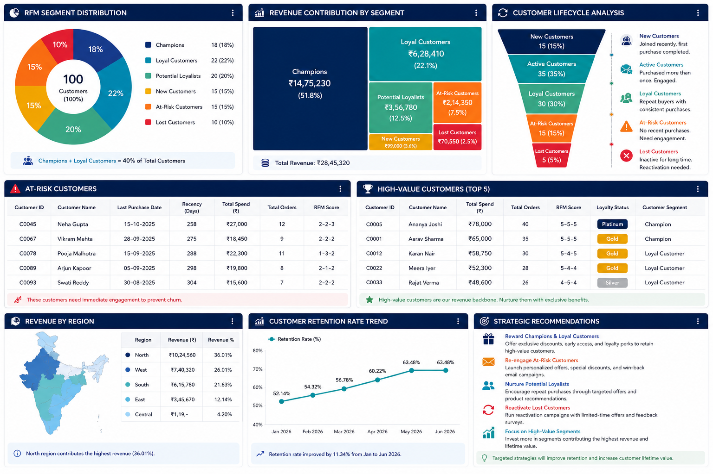

# Customer Segmentation Using RFM Model

## Objective
Identify valuable customer groups using RFM analysis.

## Business Problem
The company lacks visibility into customer loyalty and retention.

## Dataset
400+ customer records with purchase behavior.

## RFM Framework
Recency, Frequency, Monetary analysis.

## Analysis Performed
- Customer Segmentation
- Revenue Analysis
- Retention Analysis
- Loyalty Analysis

# Customer Segmentation Using RFM Model

## Dashboard Features
- KPI Cards
- Segment Distribution
- Revenue Analysis
- Customer Lifecycle

## Key Insights
Champions contribute most revenue.

## Recommendations
Increase retention through targeted campaigns.

## Conclusion
RFM segmentation improves customer engagement and profitability.
